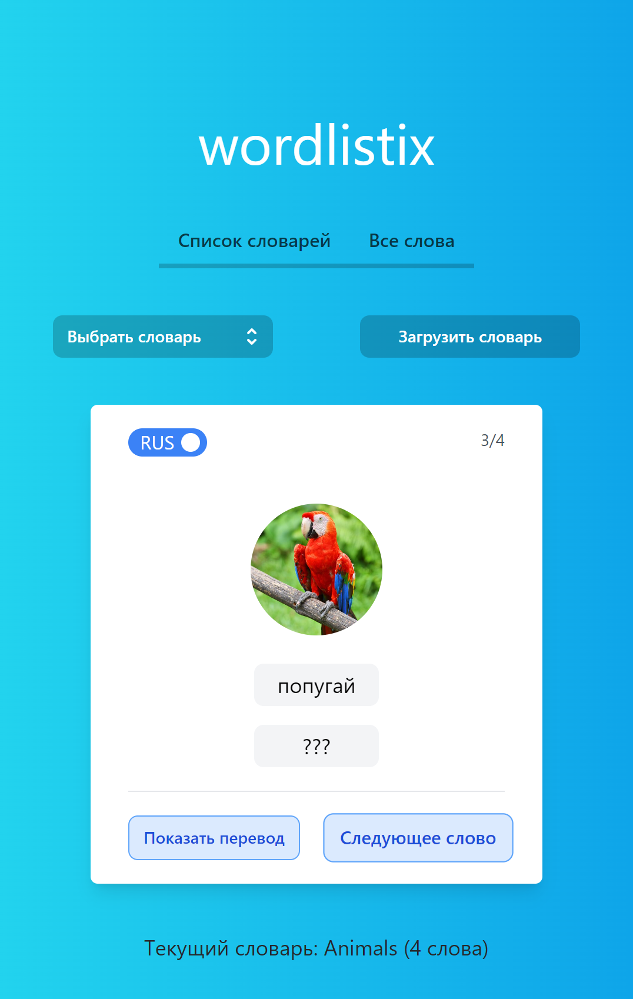

# wordlistix

> A web application that will help you learn English words



## Requirements

* PHP 7.3.0 or higher
* [PDO-SQLite]() PHP extension enabled
* [Node.js](https://nodejs.org/en/download/) installed
* and the usual [Symfony Technical Requirements](https://symfony.com/doc/5.4/setup.html#technical-requirements)

## Getting started

### Installation

Clone the repository

```bash
git clone https://github.com/chamexxxx/wordlistix.git
```

Switch to the repo folder

```bash
cd wordlistix
```

Copy the example env file

```bash
cp .env.example .env
```

Install composer dependencies

```bash
composer install
```

Install npm dependencies

```bash
npm install
```

Build assets

```bash
npm run build
```

**TL;DR command list**

```bash
git clone https://github.com/chamexxxx/wordlistix.git
cd wordlistix
cp .env.example .env
composer install
npm install
npm run build
```

### Configuring the Database

Set the `DATABASE_URL` environment variable.
SQLite is the default (**recommended**)

```dotenv
 DATABASE_URL="sqlite:///%kernel.project_dir%/var/data.db"
```

Install the sqlite driver if it can't be found

```bash
sudo apt-get install php-sqlite3
```

Create the database

```bash
php bin/console doctrine:database:create
```

Execute all migration files

```bash
php bin/console doctrine:migrations:migrate
```

### Install Symfony CLI (recommended)

[Download Symfony](https://symfony.com/download) to install the symfony binary

## Usage

If you have installed [Symfony binary](https://symfony.com/download), run this command:

```bash
symfony server:start
```

Then access the application in your browser at the given URL (http://localhost:8000 by default).

If you don't have the Symfony binary installed,
run `php -S localhost:8000 -t public/` to use the built-in PHP web server
or [configure a web server](https://symfony.com/doc/5.4/setup/web_server_configuration.html)
like Nginx or Apache to run the application.
